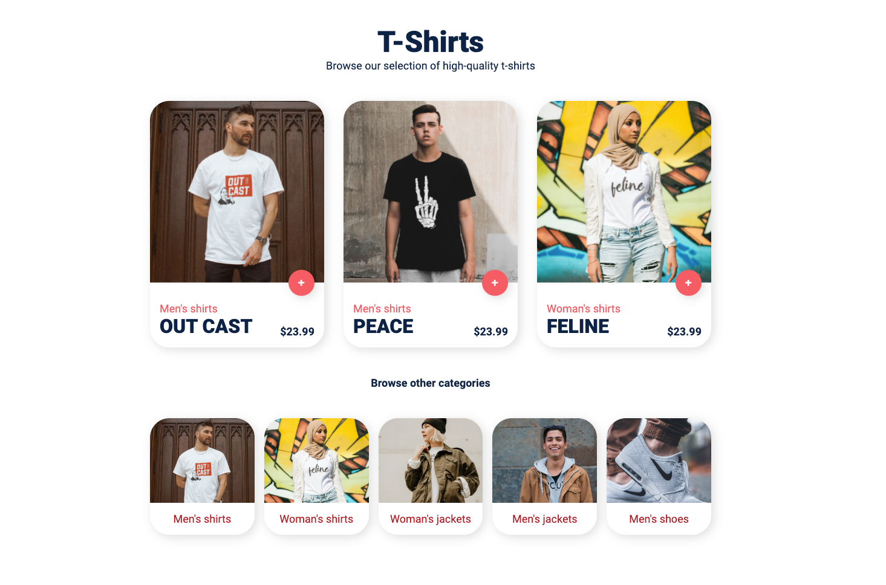

# T-shirts project

This is a practice project to improve the skills with SASS implementing [CUBE CSS](https://cube.fyi/) methodology.
It is just the layout view, has no functionality.

## What I learned

- How to use SASS implementing CUBE CSS methodology.
- Implement logical properties and new CSS properties like `scale`.

## Prerequisites

- [Node.js](https://nodejs.org/en/) installed
- [pnpm](https://pnpm.js.org/en/installation) installed

## Setup

- Clone this repo to your desktop and run `pnpm install` to install all the dependencies.

## Usage

Once the dependencies are installed, you can run `pnpm start` to start the application. You will then be able to access
it at [localhost:3000](http://localhost:3000)

